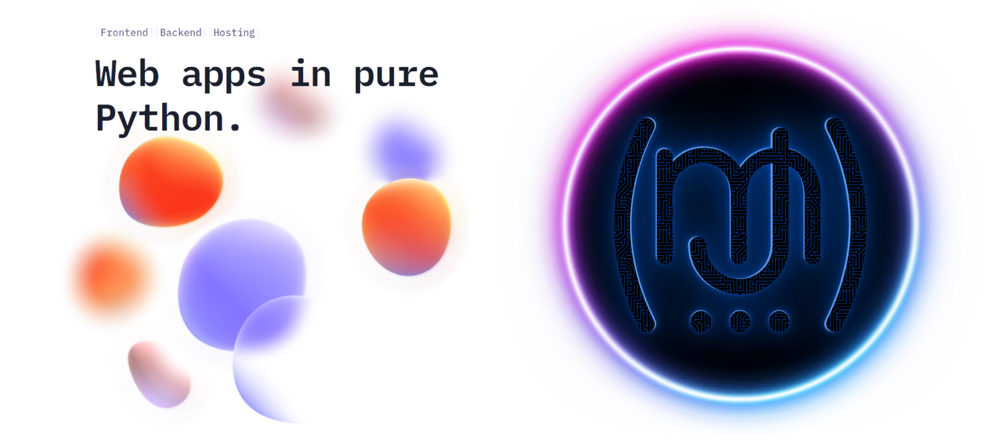

<h1 align="center">- My Web - Creada con Python y Reflex</h1>

Este repositorio contiene todo el código fuente y los recursos necesarios para construir y mantener mi sitio web, desarrollado utilizando Python y Reflex. Este es un proyecto personal para aprender y avanzar en desarrollo y diseño web. Si tienes ideas para mejorar el código o añadir nuevas funcionalidades, siéntete libre de hacer un 'fork' del repositorio y enviar tus 'pull requests'.
¡Espero que encuentres este proyecto interesante y útil! Para cualquier consulta o sugerencia, no dudes en abrir un 'issue' en este repositorio.

<h2> Tecnologías:</h2>

   
   Linux, plataforma usada para crear el código.

   
   Python, lenguaje de programación base del proyecto.

   
   Reflex, framework de desarrollo en Python para aplicaciones web, incluye backend y frontend.

   
   Docker, virtualización, desarrollo y despliegues sencillos.

